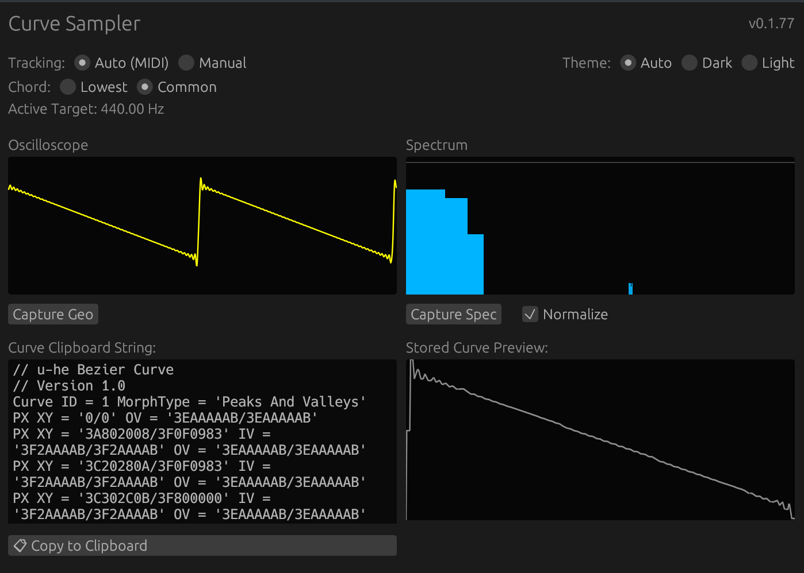
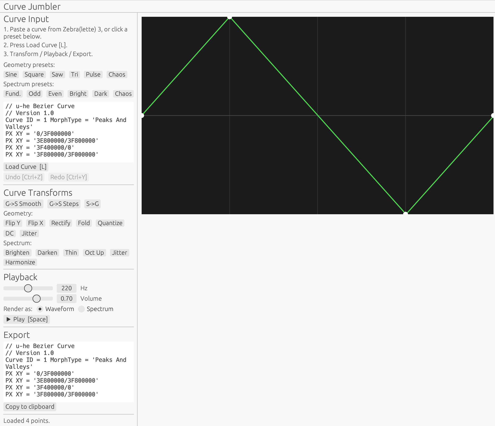

# Curve Sampler, Curve Jumbler

**Curve Sampler** is an audio plugin (VST3, CLAP) that captures waveforms from incoming audio and converts them into Zebra(lette) 3's svg-based vector graphics format, enabling a "Curve resampling" workflow.
It provides an oscilloscope and a spectrum analyzer, each with "capture to curve" functionality, allowing users to extract any single cycle of audio directly into a format they can paste into Zebra(lette) 3. 

**Curve Jumbler** runs locally in the browser. It can generate, import, transform, and export 
the vector-graphics based curves used in Zebra(lette) 3's OSC oscillator. 
As interface, it uses Zebra(lette) 3's svg-based vector graphics format.
Try it here:
[https://alexandernutz.github.io/curve-sampler/](https://alexandernutz.github.io/curve-sampler/)

## Screenshots

<table style="border: none;">
  <tr>
    <td width="50%" style="border: none; padding: 10px; vertical-align: top;">
      <strong>Curve Sampler (Plugin)</strong><br>
      
    </td>
    <td width="50%" style="border: none; padding: 10px; vertical-align: top;">
      <strong>Curve Jumbler (Web)</strong><br>
      
    </td>
  </tr>
</table>   

## Curve Sampler

Curve Sampler lets users capture single cycle waveforms in Zebra 3's curve format directly from an audio stream.

### Use Cases
- **Capture post OSC FX:** Capture a curve after Zebra 3's internal oscillator effects (useful until this becomes a native feature).
- **Capture from other Synths:** Create a Zebra curve from another synth's output (e.g., "migrating" a Serum wavetable cycle without going through intermediate files).
- **Capture Chords:** Capture a chord into a single curve. It detects up to three MIDI notes and finds a reasonable least common multiple for the wavelength, allowing you to "bake" a chordal timbre into a single oscillator cycle. (Naturally, this usually changes the root note.)

### Installation

Download the CLAP or VST3 for your platform from the releases section and place it in your plugin folder. The standard default locations are:

- **macOS VST3:** `~/Library/Audio/Plug-Ins/VST3/`
- **macOS CLAP:** `~/Library/Audio/Plug-Ins/CLAP/`
- **Windows VST3:** `C:\Program Files\Common Files\VST3\` (system-wide) or `%LOCALAPPDATA%\Programs\Common\VST3\` (current user)
- **Windows CLAP:** `C:\Program Files\Common Files\CLAP\` (system-wide) or `%LOCALAPPDATA%\Programs\Common\CLAP\` (current user)
- **Linux VST3:** `~/.vst3/` (user) or `/usr/lib/vst3/` (system-wide)
- **Linux CLAP:** `~/.clap/` (user) or `/usr/lib/clap/` (system-wide)

Most DAWs let you configure additional scan paths if you prefer a custom location.

Then restart your DAW or trigger a plugin rescan.

**macOS security warning:** Downloaded plugin binaries are quarantined by macOS. If you get a "cannot be opened" or malware warning, go to System Settings → Privacy & Security and click "Open Anyway", or run:
```bash
xattr -dr com.apple.quarantine ~/Library/Audio/Plug-Ins/VST3/CurveSampler.vst3
```
(Adjust the path if you used a custom location. See also the Security note below.)

### Usage

Steps:
 - Put Curve Sampler into audio chain at the place you want to capture and open the UI
 - Observe the oscilloscope and spectrum analyzer, press "capture" when you like what you see
 - Copy/Paste the waveform in to Zebra 3's editor ("Paste Curve") and play it back

Note that the width of the single cycle is determined either by incoming MIDI notes or by manually setting a frequency. The plugin uses zero-crossing detection and stabilization to make a best effort at a clean capture.
Read on for details.

### Finding the waveform length

To determine the length of the captured waveform cycle, Curve Sampler needs some input.

The easiest workflow is passing the same MIDI note (or simple chord) that goes into your synth directly to Curve Sampler.
Alternatively, there is the option to set up to three frequencies manually.

Note that the oscilloscope and spectrum analyzer also react to this for their display, so they act as a 
preview for the frequency setting.

Curve Sampler deals with **Chords** by trying to find a common cycle length. If it can't find a common cycle length (the common period can be impractically long), it will revert to using the lowest given note.

Hover over the frequency to get a tooltip explaining how it was computed.

Note that MIDI routing workflow depends on the specific DAW and device chain.

Some examples:
- **Bitwig + Zebra 3:** Zebra 3 and many other plugins pass through MIDI notes they receive. In that case one can just place Curve Sampler after it, and it will receive the MIDI notes live.
- **Serum / Other Synths:** Other synths, for instance Serum 2, don't pass through MIDI notes. 
  - *Bitwig Workaround:* In Bitwig, wrap the synth in an Instrument Layer and put Curve Sampler after it.
- **Other DAWs:** Setup varies and will depend on how the DAW routes MIDI. 
  - *Fallback*: If MIDI routing is a pain, just set Curve Sampler to the frequency of the note you're playing (default is A4/440Hz, so one can also just play that note when curve sampling).

## Curve Jumbler (Web App)

This repository also contains **Curve Jumbler**, a browser-based tool that allows generation and manipulation
of waveforms in the Zebra 3-style vector representation.
It allows domain transformations (Geometry ↔ Spectrum) and other curve operations (Flip, Fold, etc.). 

The workflow is :
 - Copy/Paste Curve from Z3 into Curve Jumbler (or start with a pre-defined or random curve), 
 - Do a bunch of pre-defined transformations,
 - Copy/Paste back into Z3.

Note that Curve Jumbler is less polished than Curve Sampler, since I realized at some point that the latter can do everything the former can do (sort of) and more.
Advantages of Jumbler that remain are:
 - higher import fidelity, as the Z3 curves are copied (but right now there is no way to e.g. get the curve "after effects")
 - web app -- no download/installation (also, it runs purely locally in your browser, so no cloud / data upload involved)

Curve Jumbler runs here as a "static" github page: [https://alexandernutz.github.io/curve-sampler/](https://alexandernutz.github.io/curve-sampler/)

## General Notes
These things apply to both Curve Sampler and Curve Jumbler.

### Known Limitations and Philosophy

For technical and fundamental/mathematical reasons, parts of the Curve Sampler signal chain are quite approximative. Don't expect it to always match internal waveforms with surgical accuracy—I’ve tried to get close, but I think of Curve Sampler more as a **SVG Curve playground** than a laboratory tool.

Part of the charm, in my opinion, of such a simple tool is that it doesn't have to match the quality standards of a "grown-up" plugin like Zebra 3. Keep things playful, rather than "production-grade". To me personally, one benefit is developing a better sonic intuition for waveforms, making it easier to create cool sounds down the line—whether by using tools or drawing them myself.

While the outputs sometimes are a bit "noisy," Zebra 3's inbuilt tools (Simplify, Beautify, Line-up) can often help to polish the curves with a few clicks after pasting.

Note that curves with many points can be heavy on Zebra 3's performance, especially if they are being morphed, simplifying them can help a lot there.

Furthermore **Window Resize** functionality is absent. Not for lack of trying on my side. Maybe I'll have a go at it in the near future. Feel free to reach out if you need it. 

### Technical Notes & Zebra 3 Interop

- **Point Limits:** Zebra 3 can crash if you attempt to paste a curve with an excessive number of points. Curve Sampler includes point-reduction algorithms and a hard-cap of 100 points to ensure stability.
- **Approximation:** Signal extraction from rendered audio is always approximative, but I tried to get close. (Technically: signal extraction from rendered audio is subject to the uncertainty principle; "perfect" recovery is theoretically impossible, but the use of Blackman-Harris windowing and 4-point Catmull-Rom resampling gets us very close.)

## Disclaimer & Safety

- **Security:** While rare, it is possible to spread malware through plugin binaries. This project is fully open-source, release binaries are built through GitHub's standard workflow, and my name is attached to it, which is the best "trust guarantee" I can offer. Always be cautious with unsigned binaries.
- **u-he Interop:** I don't want to cause extra work for the u-he team by "hacking" into an API (the clipboard format) that wasn't necessarily meant for this. If issues arise, I am happy to take this down or adjust it. If you're from u-he, feel free to reach out!

## Support & Bug Reports

**Found an issue?** Please open a [GitHub Issue](https://github.com/alexandernutz/curve-sampler/issues) with:
- What DAW you're using
- Steps to reproduce
- Any relevant audio or screenshot

**Platform Notes:** Tested on Bitwig (VST3), Ableton Live 11 (VST3), and Studio One (CLAP) on macOS (Apple Silicon / ARM64). Windows and Linux builds are provided but less tested—feedback welcome!

**Dependencies:** See [ACKNOWLEDGEMENTS.md](ACKNOWLEDGEMENTS.md) for a list of libraries and tools used in this project.

## AI Use Disclosure & Thoughts

I made this with the help of Claude Code and Gemini-CLI. 

I do have several years of industry/research programming experience, but I am not a DSP specialist. 
I wouldn't have been able to make this without it. The cost of learning Rust, the various frameworks, and DSP algorithms would have exceeded my current time budget (though I'd love to learn more about all of this). 

Musing: This was a new experience, it's a bit like acting as the manager of a programmer with a lot of domain knowledge (who is also inhumanly fast, but also has odd quirks that humans don't have, usually), doing the usual iterations one would do when programming in a team. I think this process still can be done with more or less diligence -- suffice to say, I'm not trying to build AI-code-slop here, but make something that makes sense and is useful and practical.
AI hopefully just allows me to operate on this more abstract level, while still retaining all of my personal intentions. 
I guess we'll all have to see where this goes and hopefully be responsible about it ...

## Licensing

**Source Code:** MIT 

**Plugin Binaries (in releases):**
- **CLAP:** MIT
- **VST3:** GPLv3

---

**Version:** 0.2.4
